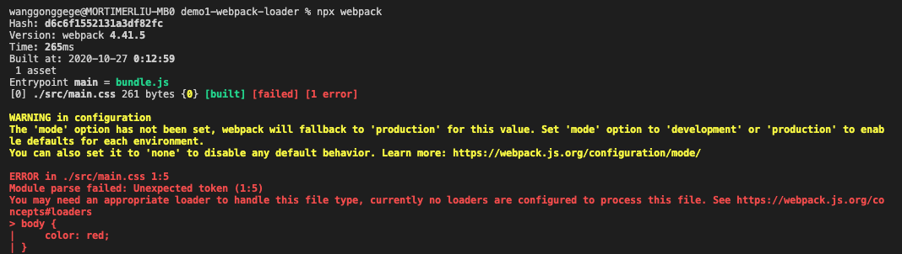
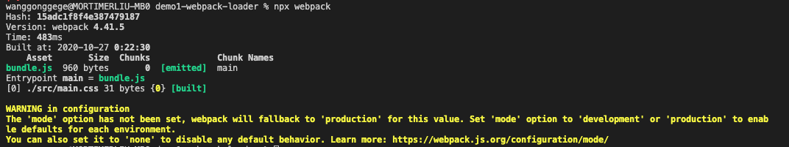

# Loader

> Webpack 实现不同种类资源模块加载的核心就是 Loader

## 1. 如何加载资源模块

参考 demo1-webpack-loader目录。
main.css内容如下：

```css
body {
    color: red;
}
```

webpack的打包文件应该是一个JS文件，但在代码中，尝试使用CSS文件作为入口文件，会有模块解析错误。



我们需要用适当的加载器来处理这种文件类型，而当前并没有配置一个可以用来处理此文件的加载器。

出现这个错误的原因是因为 Webpack 内部默认只能够处理 JS 模块代码。
> 在打包过程中，Webpack默认把所有遇到的文件都当作 JavaScript 代码进行解析。
> 在demo1代码中， Webpack 处理的是 CSS 代码，而 CSS 代码不符合 JavaScript 语法，所以报出模块解析错误。

为了证明上面这句话，我将main.css文件更改如下:

```css
console.log('this a css file');
```

webpack可成功打包，证明了webpack打包只是按照 JavaScript 语法解析模块。



我们继续看一下之前的提示：


错误是： You may need an appropriate loader to handle this file type, currently no loaders are configured to process this file. （我们需要用适当的加载器来处理这种文件类型，而当前并没有配置一个可以用来处理此文件的加载器）

结论：Webpack 是用 Loader（加载器）来处理每个模块的，而内部默认的 Loader 只能处理 JS 模块，如果需要加载其他类型的模块就需要配置不同的 Loader。

## 2. 加载器的使用方式

css-loader: 加载CSS的loader

> css-loader 只会把 CSS 模块加载到 JS 代码中，而并不会使用这个模块。

如何安装？
```js
npm install css-loader --save-dev 
// 或者
yarn add css-loader --dev
```

webpack.config.js 下配置module属性，其中的rules数组就是我们针对资源模块的加载规则配置。
每个规则对象都需要两个属性：
- test 属性，它是一个正则表达式，用来匹配打包过程中所遇到文件路径，这里我们是以 .css 结尾；
- use 属性，它用来指定匹配到的文件需要使用的 loader，这里用到的是 css-loader。

style-loader: 将 css-loader 中所加载到的所有样式模块，通过创建 style 标签的方式添加到页面上

安装style-loader:
```js
npm install style-loader --save-dev 
```

## 3. 通过 JS 加载资源模块

一般 Webpack 打包的入口还是 JavaScript。因为从某种程度上来说，打包入口就是应用的运行入口，而目前前端应用中的业务是由 JS 驱动的，所以更合理的做法还是把 JS 文件作为打包的入口，然后在 JS 代码中通过 import 语句去加载 CSS 文件。

即便是通过 JS 代码去加载的 CSS 模块，css-loader 和 style-loader 仍然可以正常工作。因为 Webpack 在打包过程中会循环遍历每个模块，然后根据配置将每个遇到的模块交给对应的 Loader 去处理，最后再将处理完的结果打包到一起。

## 4. 为什么要在 JS 中加载其他资源

Webpack 的设计哲学:  Webpack 建议在 JavaScript 中引入 CSS，同时建议在代码中引入当前业务所需要的任意资源文件。因为真正需要这个资源的并不是整个应用，而是你此时正在编写的代码。

> 假设我们在开发页面上的某个局部功能时，需要用到一个样式模块和一个图片文件。如果你还是将这些资源文件单独引入到 HTML 中，然后再到 JS 中添加对应的逻辑代码。试想一下，如果后期这个局部功能不用了，你就需要同时删除 JS 中的代码和 HTML 中的资源文件引入，也就是同时需要维护这两条线。而如果你遵照 Webpack 的这种设计，所有资源的加载都是由 JS 代码控制，后期也就只需要维护 JS 代码这一条线了。

JavaScript 代码本身负责完成整个应用的业务功能，JS驱动了整个前端应用，而 JavaScript 代码在实现业务功能的过程中需要用到样式、图片等资源文件。如果建立这种依赖关系：
- 逻辑上比较合理，因为 JS 确实需要这些资源文件配合才能实现整体功能
- 配合 Webpack 这类工具的打包，能确保在上线时，资源不会缺失，而且都是必要的。

> 每接触到一个新的加载器，核心就是搞明白这个 Loader 内部到底做了什么事情，它的目标是什么，其次才是这个 Loader 的配置用法。

## 5. 开发一个 Loader

> Loader 作为 Webpack 的核心机制，内部的工作原理却非常简单

每个 Webpack 的 Loader 都需要导出一个函数，这个函数就是我们这个 Loader 对资源的处理过程，它的输入就是加载到的资源文件内容，输出就是我们加工后的结果。

> use 中不仅可以使用模块名称，还可以使用模块文件路径，这点与 Node 中的 require 函数是一样的。

Loader 函数的参数是文件的内容。

Webpack 加载资源文件的过程类似于一个工作管道，你可以在这个过程中依次使用多个 Loader，但是最终这个管道结束过后的结果必须是一段标准的 JS 代码字符串。

代码参考 **./markdown-loader.js**。
Webpack 还允许我们在返回的代码中使用 ES Modules 的方式导出。将 module.exports 修改为 export default，然后运行打包，结果同样是可以的，Webpack 内部会自动转换 ES Modules 代码。

use 接收一个数组时，多个loader 依次**从右往左**执行。


